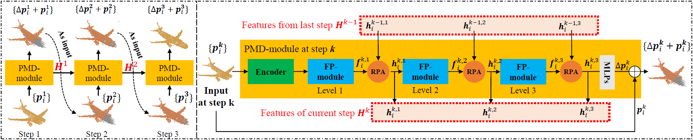

# PMP-Net++: Point Cloud Completion by Transformer-Enhanced Multi-step Point Moving Paths (TPAMI 2023)

[](pics/network.png)

## [NEWS]

- **2022-03 [NEW:tada:]** The [Jittor](https://cg.cs.tsinghua.edu.cn/jittor/) implementations of both PMP-Net and PMP-Net++ are released in the [PMPPlus-Jittor](https://github.com/diviswen/PMP-Net/tree/main/PMPPlus-Jittor) folder.
- **2022-02 [NEW:tada:]** [PMP-Net++](https://arxiv.org/abs/2012.03408), the journal extension of PMP-Net is accepted to [TPAMI](https://ieeexplore.ieee.org/document/9735342). This repository now contains the code of both PMP-Net and PMP-Net++!
- **2021** [PMP-Net](https://arxiv.org/abs/2012.03408) is published at [CVPR 2021](https://openaccess.thecvf.com/content/CVPR2021/html/Wen_PMP-Net_Point_Cloud_Completion_by_Learning_Multi-Step_Point_Moving_Paths_CVPR_2021_paper.html), and the code is released!

## [PMP-Net++]
This repository contains the PyTorch implementation and Jittor implementation of the papers:

**1. PMP-Net++: Point Cloud Completion by Transformer-Enhanced Multi-step Point Moving Paths, TPAMI 2023**

**2. PMP-Net: Point Cloud Completion by Learning Multi-step Point Moving Paths, CVPR 2021**

[ [PMP-Net](https://arxiv.org/abs/2012.03408) | [PMP-Net++](https://arxiv.org/abs/2012.03408) | [IEEE Xplore](https://ieeexplore.ieee.org/document/9735342) | [Webpage]() | [Jittor](https://cg.cs.tsinghua.edu.cn/jittor/) ] 

> Point cloud completion concerns to predict missing part for incomplete 3D shapes. A common strategy is to generate
complete shape according to incomplete input. However, unordered nature of point clouds will degrade generation of high-quality 3D
shapes, as detailed topology and structure of unordered points are hard to be captured during the generative process using an
extracted latent code. We address this problem by formulating completion as point cloud deformation process. Specifically, we design a
novel neural network, named PMP-Net++, to mimic behavior of an earth mover. It moves each point of incomplete input to obtain a
complete point cloud, where total distance of point moving paths (PMPs) should be the shortest. Therefore, PMP-Net++ predicts
unique PMP for each point according to constraint of point moving distances. The network learns a strict and unique correspondence
on point-level, and thus improves quality of predicted complete shape. Moreover, since moving points heavily relies on per-point
features learned by network, we further introduce a transformer-enhanced representation learning network, which significantly
improves completion performance of PMP-Net++. We conduct comprehensive experiments in shape completion, and further explore
application on point cloud up-sampling, which demonstrate non-trivial improvement of PMP-Net++ over state-of-the-art point cloud
completion/up-sampling methods

## [Cite this work]

```
@ARTICLE{pmpnet++,
  author={Wen, Xin and Xiang, Peng and Han, Zhizhong and Cao, Yan-Pei and Wan, Pengfei and Zheng, Wen and Liu, Yu-Shen},
  journal={IEEE Transactions on Pattern Analysis and Machine Intelligence}, 
  title={PMP-Net++: Point Cloud Completion by Transformer-Enhanced Multi-Step Point Moving Paths}, 
  year={2023},
  volume={45},
  number={1},
  pages={852-867},
  doi={10.1109/TPAMI.2022.3159003}}

@inproceedings{wen2021pmp,
    title={PMP-Net: Point cloud completion by learning multi-step point moving paths},
    author={Wen, Xin and Xiang, Peng and Han, Zhizhong and Cao, Yan-Pei and Wan, Pengfei and Zheng, Wen and Liu, Yu-Shen},
    booktitle={Proceedings of the IEEE Conference on Computer Vision and Pattern Recognition (CVPR)},
    year={2021}
}
```

## [Getting Started]
#### Datasets and Pretrained Models

We use the [PCN](https://www.shapenet.org/) and [Compeletion3D](http://completion3d.stanford.edu/) datasets in our experiments, which are available below:

- [PCN](https://drive.google.com/drive/folders/1P_W1tz5Q4ZLapUifuOE4rFAZp6L1XTJz)
- [Completion3D](http://download.cs.stanford.edu/downloads/completion3d/dataset2019.zip)

The pretrained models on Completion3D and PCN dataset are available as follows:

- [PMP-Net_pre-trained](https://drive.google.com/drive/folders/1emGsfdnIj1eUtUxZlfiWiuJ0QJag4nOn?usp=sharing)

Backup Links:

- [PMP-Net_pre-trained](https://pan.baidu.com/s/1oQbaVI7yN9NmI_2E9tztGQ) (pwd: n7t4)

#### Install Python Denpendencies

```
cd PMP-Net
conda create -n pmp python=3.7
conda activate pmp
pip3 install -r requirements.txt
```

#### Build PyTorch Extensions

**NOTE:** PyTorch >= 1.4 of cuda version are required.

```
cd pointnet2_ops_lib
python setup.py install

cd ..

cd Chamfer3D
python setup.py install
```

You need to update the file path of the datasets:

```
__C.DATASETS.COMPLETION3D.PARTIAL_POINTS_PATH    = '/path/to/datasets/Completion3D/%s/partial/%s/%s.h5'
__C.DATASETS.COMPLETION3D.COMPLETE_POINTS_PATH   = '/path/to/datasets/Completion3D/%s/gt/%s/%s.h5'
__C.DATASETS.SHAPENET.PARTIAL_POINTS_PATH        = '/path/to/datasets/ShapeNet/ShapeNetCompletion/%s/partial/%s/%s/%02d.pcd'
__C.DATASETS.SHAPENET.COMPLETE_POINTS_PATH       = '/path/to/datasets/ShapeNet/ShapeNetCompletion/%s/complete/%s/%s.pcd'

# Dataset Options: Completion3D, Completion3DPCCT, ShapeNet, ShapeNetCars
__C.DATASET.TRAIN_DATASET                        = 'ShapeNet'
__C.DATASET.TEST_DATASET                         = 'ShapeNet'
```

#### Training, Testing and Inference

To train PMP-Net++ or PMP-Net, you can simply use the following command:

```
python main_*.py  # remember to change '*' to 'c3d' or 'pcn', and change between 'import PMPNetPlus' and 'import PMPNet'
```

To test or inference, you should specify the path of checkpoint if the config_*.py file
```
__C.CONST.WEIGHTS                                = "path to your checkpoint"
```

then use the following command:

```
python main_*.py --test
python main_*.py --inference
```

## [Acknowledgements]

Some of the code of this repo is borrowed from [GRNet](https://github.com/hzxie/GRNet), [pytorchpointnet++](https://github.com/erikwijmans/Pointnet2_PyTorch) and [ChamferDistancePytorch](https://github.com/ThibaultGROUEIX/ChamferDistancePytorch). We thank the authors for their wonderful job!

## [License]

This project is open sourced under MIT license.
